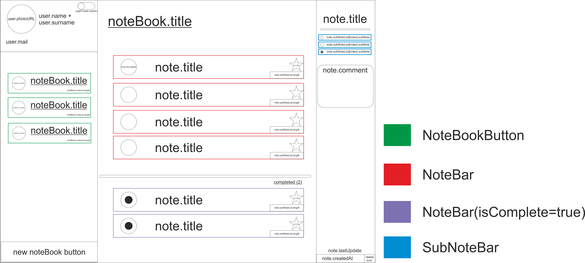

# //TODO List

Microsoft To Do uygulamasının flutter klonunu yapmaya çalışıyorum.

## Uyuglama şunları içermelidir.

- :white_circle: Üyelik girişi.
- :white_circle: İnternet olan her platformdan bağlantı.
- :white_circle: İnternet yokken önbellekteki verilerin durması ve internet yokken yapılan güncellemeyi internet bağlantısı olduğunda veri tabanına bildirme.

## İçinde kullanmayı düşündüğüm servisler.

- Flask ile yapılmış bir API 
- PostgreSQL veri tabanı.
- Authantication servisi. (Henüz belirlenmedi)

<<<<<<< HEAD

=======
## Kullanılan flutter paketleri

- :white_circle: Shared Preferences (Siyah beyaz tema çerezleri)
- :white_circle: Sadece http methodları.[Dio] (Servise özel paket kullanılmayacak. Paket bağımlılığını azaltma amaçlı.)
- :white_circle: Provider (state management)
>>>>>>> c5159debe8b1a8cbb7bb8a2221b4f78f096d3fa3
