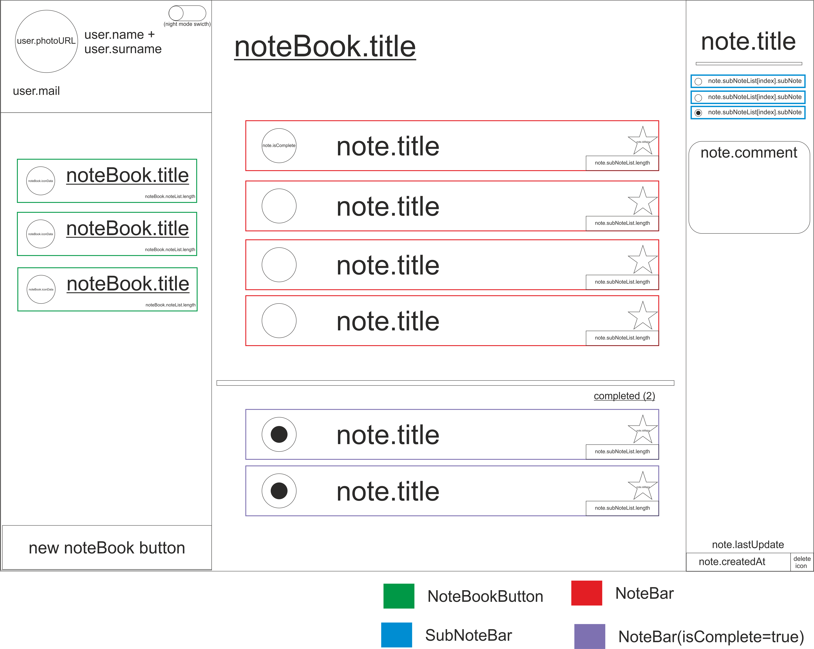
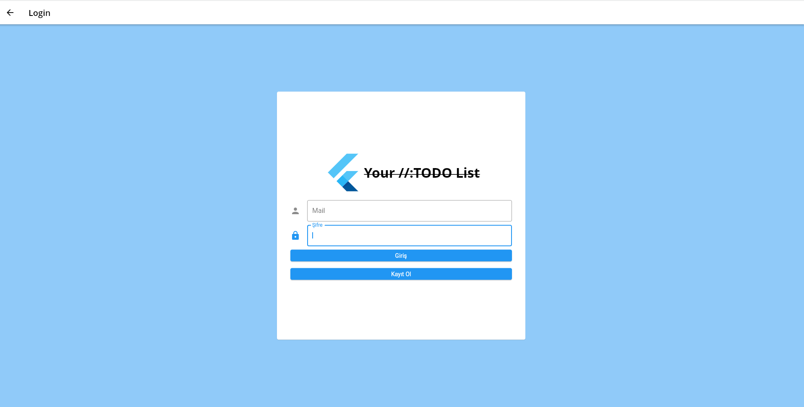
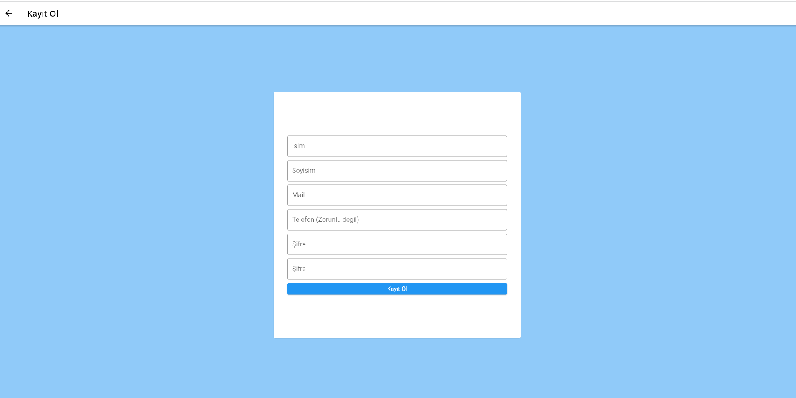
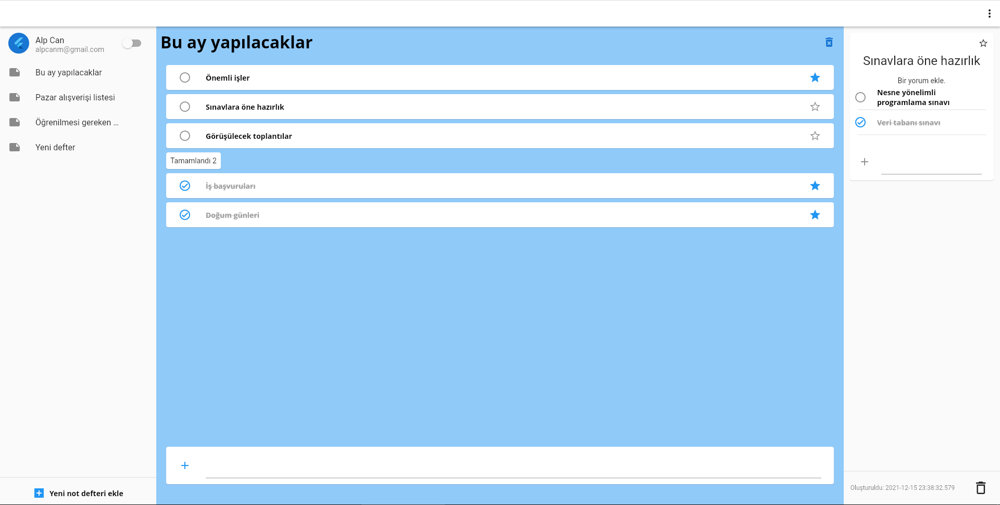
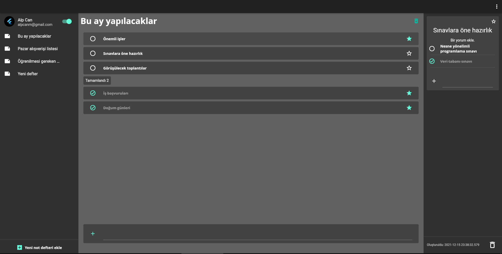
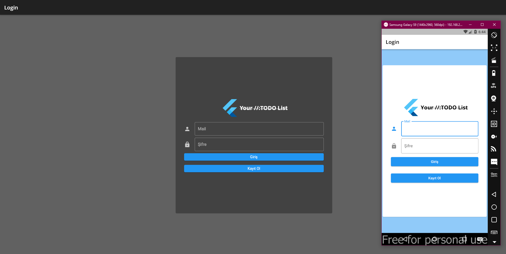

# //TODO List

Microsoft To Do uygulamasının flutter klonunu yapmaya çalışıyorum.
Not: Bu proje[flask](https://github.com/alpcanm/flask_api) projesi ile bağlantılıdır.

## Uyuglama şunları içermektedir.

- Flask ile yapılmış bir API [Bu proje](https://github.com/alpcanm/flask_api)
- PostgreSQL veri tabanı.
- JSON Web Tokens kullanılarak yapılmış basit bir authantication sistemi.

## Ürünün ilk taslağı.

## Ürünün son hali.
-  Web versiyonu.

-  Mobil versiyonu.

## Kullanılan flutter paketleri
-  Local db [Hive](https://pub.dev/packages/hive) (Siyah beyaz tema çerezleri, Token tutma işlemleri.)
-  Api bağlantı. [dio](https://pub.dev/packages/dio) (Servise özel paket kullanılmadı (Firebase vs.). Paket bağımlılığını azaltma amaçlı.)
-  State management [provider ](https://pub.dev/packages/provider)
-  Locator [get_it](https://pub.dev/packages/get_it)
-  Navigation [auto_route](https://pub.dev/packages/auto_route)

